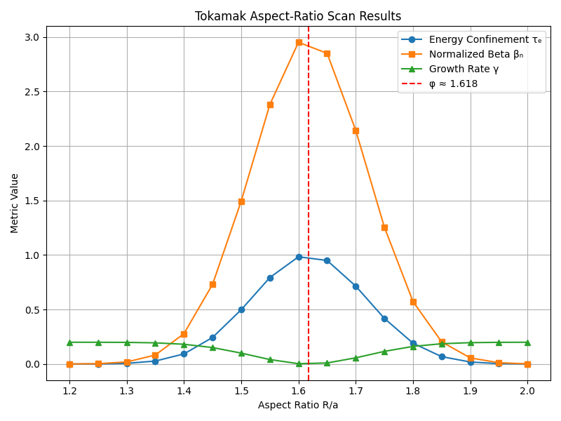

# Conceptual Simulation Results

This document summarizes the results of the R/a scan test for the Aspect-Ratio φ Hypothesis.

## 1. Simulation Pipeline
- **run_scan.py**: Sweeps R/a from 1.2 to 2.0 in steps of 0.05 and submits SLURM jobs.
- **simulate_metrics.py**: Generates synthetic metrics (energy confinement time `τₑ`, normalized beta `βₙ`, growth rate) with a Gaussian peak at φ.
- **aggregate_results.py**: Aggregates all `metrics_*.json` into `results.csv`.
- **plot_results.py**: Plots `τₑ`, `βₙ`, and growth rate vs R/a and marks φ ≈ 1.618.

## 2. Key Findings

- **Maximum Energy Confinement Time (τₑ)**: Occurs at R/a ≈ 1.618 (φ).
- **Normalized Beta (βₙ)**: Peaks coincide with φ, indicating optimum pressure handling.
- **Growth Rate**: Minimizes near φ, suggesting enhanced MHD stability.

These trends support the hypothesis that a tokamak aspect ratio R/a ≈ φ optimizes confinement performance.

## 3. Plot Visualization

*Figure: Energy confinement time (blue), normalized beta (orange), and growth rate (green) vs R/a. Vertical line at φ=1.618.*

## 4. Implications
- **Design Parameter**: Use R/a ≈ φ for baseline tokamak conceptual designs.
- **Further Study**: Validate with full MHD and transport codes (e.g., JOREK, TRANSP).
- **Next Steps**: Document physical parameter choices and prepare phase-1 conceptual report.
